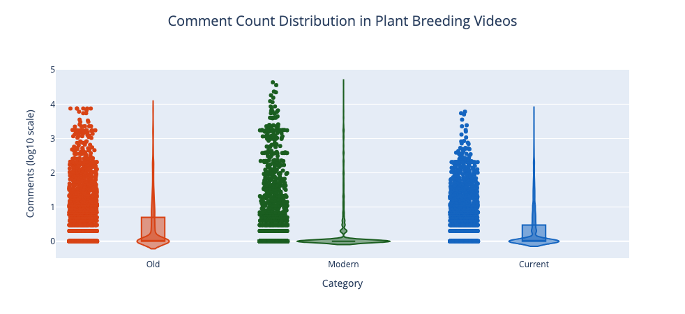

# YouTube Data Analysis Project
This project is an analysis of YouTube (Global) data to understand the trends of plant breeding related **8,971 videos** with **2.1 billion views** for **198 keywords** in **3 categories of concepts** (Old, Current, Modern) (**English** language only). You can see the results with the help of a dashboard after running the script.

## Project Setup
### 1. Clone the repository:
```bash
git clone git@github.com:nfornadimkhan/data_analysis_youtube.git
cd data_analysis_youtube
```

### 2. Install required packages
```bash
pip install -r requirements.txt
```   

### 3. Run the Application
```bash
streamlit run dashboard.py
```

## To run a fresh analysis setup the API Configuration
Get a YouTube Data API key from the [Google Cloud Console](https://console.cloud.google.com/)
Set up environment variables:
   - Copy `.env.example` to `.env`:
     ```bash
     cp .env.example .env
     ```
   - Edit `.env` and add your YouTube API key:
     ```
     YOUTUBE_API_KEY=your_actual_api_key_here
     ```

## Project Structure
├── README.md
├── requirements.txt
├── analysis.ipynb
├── .env.example
├── .env # (git-ignored)
├── .gitignore
├── youtube_data_fetcher.py
├── dashboard.py
├── pre-commit (pre-commit hook to check for API keys in the code - a security measure)
├── youtube_data/contains all the data fetched from YouTube in .csv format.
├── fetch_state.json

## API Choice
- YouTube is a powerful platform and it is the second largest search engine after Google worldwide.
- It has quota limit of 10,000 units per day which can be used free of cost.
- As this API requires registration, we have saved all the retrieved data in the youtube_data/all_videos_data.csv file. 
- We have also saved the state of the data fetching in the fetch_state.json file to track the progress of the script each time it is run which ensures that we don't fetch the same data multiple times. And also to avoid the quota limit.

## Problem Statement
- We want to start a YouTube channel focusing on concepts related to plant breeding. There are many SEO tools available to analyze the trends of keywords. They just focus on the keyword search volume or basic trends. But they are not efficient to analyze the trends on broader horizon with simultaneous analysis of multiple categories of keywords with interaction of audience (like likes, comments, etc.). 
- We want to analyze the trends on broader horizon utilizing the knowledge of Python and APIs. Therefore we chose YouTube API as YouTube hosts a large amount of educational or documentary-style videos, from research institutions, universities, individual experts, and even farmers sharing experiences. This diversity of video content makes YouTube a perfect platform for collecting data on how plant breeding concepts are being taught, discussed, and popularized.

## Objectives
As a student of Crop Science (Plant Breeding and Seed Science) together with my group memeber, Samaneh Javidian, we wanted to analyze following things:
   1. Is it a good idea to start a YouTube channel focusing on plant breeding concepts? Are people really interested in plant breeding related concepts?
   2. On what kind of topics should we start to get more engagement with higher views? Should we start with the old or current or modern concepts?
   3. Identify relevant keywords for plant breeding concepts.
   4. What is the best time to publish the videos to get more engagement?

## Methodology
- Collect data from YouTube using the [YouTube API](https://developers.google.com/youtube/v3) based on specific plant breeding keywords.
- Save the data categorized in **3 categories** in a structured format in csv file for further analysis. Following data is saved:
  - Keyword: 66 keywords in each category (total 66 x 3 = **198 keywords**).
  - Category Wise: Old, Current, Modern
  - Video ID
  - Video Title
  - Published Date
  - Duration of the video
  - View Count
  - Like Count
  - Comment Count
- Analyze the collected data to determine trends in viewership and engagement.

## Libraries Used
- **pandas:** For data manipulation and analysis
- **numpy:** For numerical operations
- **matplotlib:** For creating static, interactive, and animated visualizations
- **seaborn:** For creating statistical data visualizations
- **plotly:** For creating interactive web-based visualizations
- **nltk:** For natural language processing (e.g., tokenizing words in text).
- **sentence-transformers:** For encoding sentences into vector representations using BERT.
- **scikit-learn:** For machine learning algorithms and tools.
- **google-api-python-client:** For handling YouTube Data API v3.
- **python-dotenv:** For loading environment variables.
- **isodate:** For parsing and manipulating dates and times.
- **tabulate:** For creating tables.
- **streamlit:** For creating interactive web applications (for visualization).

## Keyword Classification
Here we try to use an analytical approach to classify keywords into 3 categories with the help of historical relevance, technological advancement, and future research trends in plant breeding.

**1. Old (Traditional Methods):**
Keywords in the Old category were derived from practices dominant before the 20th century, emphasizing phenotype-based selection and indigenous approaches.
- These keywords are rooted in the practices before the advent of molecular biology.
- Focuses on phenotypic selection, landrace improvement, and methods relying heavily on field observation and generational improvement.
- Emphasizes low-technology, empirical, and community-based methods.

**2. Current (Established/Conventional Methods):**
Keywords in the Current category represent methods broadly adopted in the late 20th century and still in use today, often integrating molecular biology for improved efficiency.
- Represent technologies widely used today, incorporating molecular biology but not the most advanced techniques.
- Includes marker-assisted selection (MAS), QTL mapping, and heterosis exploitation.
- These methods aim to balance efficiency and accessibility for commercial and academic breeding.

**3. Modern (Cutting-Edge/Future Methods):**
Keywords in the Modern category highlight cutting-edge and emerging areas driven by computational biology, AI, and genomics.
- Reflect cutting-edge technologies that use computational tools, CRISPR, and omics sciences.
- These methods are either newly implemented or have potential for future adoption.
- Focuses on precision, automation, and integrating bioinformatics for decision-making.

## Keywords
### **Old Plant Breeding (66 Keywords)**  
1. Traditional selective breeding in plant breeding  
2. Landrace selection in plant breeding  
3. Phenotypic selection in plant breeding  
4. Pedigree breeding in plant breeding  
5. Mass selection in plant breeding  
6. Clonal selection in plant breeding  
7. Family selection in plant breeding  
8. Open pollination in plant breeding  
9. Hybridization techniques in plant breeding  
10. Genetic diversity preservation in plant breeding  
11. Crop domestication in plant breeding  
12. Traditional farmer selection in plant breeding  
13. Indigenous breeding methods in plant breeding  
14. Germplasm conservation in plant breeding  
15. Heritage crop breeding in plant breeding  
16. Regional adaptation breeding in plant breeding  
17. Cross-pollination techniques in plant breeding  
18. Seed saving practices in plant breeding  
19. Ancestral crop improvement in plant breeding  
20. Wild relative breeding in plant breeding  
21. Traditional varietal selection in plant breeding  
22. Local adaptation breeding in plant breeding  
23. Empirical crop selection in plant breeding  
24. Population improvement in plant breeding  
25. Traditional genetic diversity in plant breeding  
26. Manual trait selection in plant breeding  
27. Phenotype-based breeding in plant breeding  
28. Generational crop improvement in plant breeding  
29. Agronomic performance selection in plant breeding  
30. Community-based breeding in plant breeding  
31. Geographic adaptation in plant breeding  
32. Reproductive isolation techniques in plant breeding  
33. Evolutionary breeding approaches in plant breeding
34. Reciprocal recurrent selection in plant breeding
35. Line breeding in plant breeding
36. Composite crossing in plant breeding
37. Mass-pedigree method in plant breeding
38. Diallel crossing in plant breeding
39. Synthetic variety breeding in plant breeding
40. Bulk population method in plant breeding
41. Traditional crop rotation effects in plant breeding
42. Monoculture improvement in plant breeding
43. Natural trait segregation in plant breeding
44. Seedbed selection in plant breeding
45. Pure-line selection in plant breeding
46. Hardy-Weinberg principle in plant breeding
47. Traditional soil suitability tests in plant breeding
48. Indigenous pest resistance breeding in plant breeding
49. Farmer-participatory breeding in plant breeding
50. In situ conservation breeding in plant breeding
51. Traditional field trials in plant breeding
52. Manual self-pollination techniques in plant breeding
53. Natural outcrossing studies in plant breeding
54. Selective pressure analysis in plant breeding
55. Regional cropping system adaptation in plant breeding
56. Propagation techniques in plant breeding
57. Ancient grain breeding in plant breeding
58. Local seed exchange practices in plant breeding
59. Historical agronomic practices in plant breeding
60. Subsistence crop breeding in plant breeding
61. Folk selection methods in plant breeding
62. Landrace improvement cycles in plant breeding
63. Regional biotic stress breeding in plant breeding
64. Crop resilience through generations in plant breeding
65. Traditional soil fertility management in plant breeding
66. Traditional drought tolerance breeding in plant breeding


---

### **Current (Established/Conventional) Plant Breeding (66 Keywords)**  
1. Marker-assisted selection in plant breeding  
2. Quantitative trait loci (QTL) mapping in plant breeding  
3. Hybrid vigor breeding in plant breeding  
4. Backcross breeding in plant breeding  
5. Recurrent selection in plant breeding  
6. Multiline breeding in plant breeding  
7. Heterosis breeding in plant breeding  
8. Advanced generation breeding in plant breeding  
9. Genome-wide selection in plant breeding  
10. Phenotypic screening in plant breeding  
11. Molecular marker development in plant breeding  
12. Genetic diversity analysis in plant breeding  
13. Performance testing in plant breeding  
14. Trait introgression in plant breeding  
15. Advanced breeding lines in plant breeding  
16. Genetic variability assessment in plant breeding  
17. Progeny testing in plant breeding  
18. Breeding value estimation in plant breeding  
19. Population genetics in plant breeding  
20. Crop improvement strategies in plant breeding  
21. Genetic gain prediction in plant breeding  
22. Breeding program design in plant breeding  
23. Genetic uniformity in plant breeding  
24. Controlled pollination in plant breeding  
25. Genetic resource management in plant breeding  
26. Phenotypic plasticity in plant breeding  
27. Breeding efficiency in plant breeding  
28. Genetic complexity analysis in plant breeding  
29. Reproductive biology in plant breeding  
30. Crop adaptation mechanisms in plant breeding  
31. Statistical genetics in plant breeding  
32. Breeding methodology optimization in plant breeding
33. Classical resistance breeding in plant breeding
34. Genomic in situ hybridization (GISH) in plant breeding
35. Haploidy induction in plant breeding
36. Bi-parental mapping populations in plant breeding
37. Multi-parental breeding approaches in plant breeding
38. Doubled haploid technology in plant breeding
39. Epistasis analysis in plant breeding
40. Trait stacking in plant breeding
41. Transcriptomics in plant breeding
42. Isozyme markers in plant breeding
43. Breeding for disease resistance in plant breeding
44. DArT marker technology in plant breeding
45. AFLP marker systems in plant breeding
46. SNP genotyping in plant breeding
47. Biochemical marker-assisted breeding in plant breeding
48. Marker-based recurrent selection in plant breeding
49. Breeding for yield stability in plant breeding
50. Abiotic stress tolerance breeding in plant breeding
51. Pre-breeding programs in plant breeding
52. Crop modeling integration in plant breeding
53. Germplasm enhancement in plant breeding
54. Controlled environment breeding in plant breeding
55. Speed breeding protocols in plant breeding
56. High-yield variety development in plant breeding
57. Disease-resistance introgression in plant breeding
58. Fusarium wilt tolerance breeding in plant breeding
59. High-oil content breeding in plant breeding
60. MABC (Marker-Assisted Backcrossing) in plant breeding
61. Field trial optimization in plant breeding
62. Regional trait evaluation in plant breeding
63. Statistical QTL analysis in plant breeding
64. Breeding for micronutrient density in plant breeding
65. Controlled hybrid seed production in plant breeding
66. Genotypic adaptability analysis in plant breeding

---

### **Modern (Cutting-Edge) Plant Breeding (66 Keywords)**  
1. CRISPR gene editing in plant breeding  
2. Genome sequencing in plant breeding  
3. Precision breeding in plant breeding  
4. Synthetic biology in plant breeding  
5. Gene network analysis in plant breeding  
6. Metabolic engineering in plant breeding  
7. Transgenic development in plant breeding  
8. Next-generation sequencing in plant breeding  
9. Epigenetic modification in plant breeding  
10. Machine learning in plant breeding  
11. Artificial intelligence prediction in plant breeding  
12. RNA interference in plant breeding  
13. Genome editing techniques in plant breeding  
14. Advanced phenotyping in plant breeding  
15. Computational breeding in plant breeding  
16. Genomic selection in plant breeding  
17. Metabolomics in plant breeding  
18. Proteomics applications in plant breeding  
19. Systems biology in plant breeding  
20. Nano-biotechnology in plant breeding  
21. Digital phenotyping in plant breeding  
22. Advanced genetic transformation in plant breeding  
23. Molecular breeding platforms in plant breeding  
24. Genome-wide association studies in plant breeding  
25. Synthetic genomics in plant breeding  
26. Predictive breeding models in plant breeding  
27. High-throughput screening in plant breeding  
28. Gene regulatory network in plant breeding  
29. Advanced trait mapping in plant breeding  
30. Computational genomics in plant breeding  
31. Climate-resilient breeding in plant breeding  
32. Precision agriculture technologies in plant breeding  
33. Adaptive breeding strategies in plant breeding
34. CRISPR-Cas9 delivery systems in plant breeding
35. Pangenomics in plant breeding
36. Hologenomics in plant breeding
37. Digital twin modeling in plant breeding
38. Epigenome-wide association studies in plant breeding
39. Single-cell sequencing in plant breeding
40. Multi-omics integration in plant breeding
41. Deep learning for trait prediction in plant breeding
42. Blockchain for seed traceability in plant breeding
43. Sensor-based phenotyping in plant breeding
44. Quantum computing in plant breeding
45. Virtual reality applications in plant breeding
46. Synthetic promoter engineering in plant breeding
47. Biostimulant-driven breeding in plant breeding
48. Photosynthetic efficiency optimization in plant breeding
49. AI-based genome annotation in plant breeding
50. Cellular reprogramming in plant breeding
51. Carbon sequestration traits breeding in plant breeding
52. Eco-genomics in plant breeding
53. Functional metagenomics in plant breeding
54. Robotic phenotyping in plant breeding
55. Non-coding RNA studies in plant breeding
56. Microbiome-assisted breeding in plant breeding
57. Advanced chloroplast transformation in plant breeding
58. Pathogenomics applications in plant breeding
59. Environmental DNA (eDNA) in plant breeding
60. Autonomous breeding programs in plant breeding
61. Thermo-tolerance breeding in plant breeding
62. Urban crop development in plant breeding
63. Biodegradable agro-inputs breeding in plant breeding
64. Real-time molecular diagnostics in plant breeding
65. Holistic systems breeding in plant breeding
66. Predictive climate modeling in plant breeding


# Steps Followed
## Step 1: Data Collection
- Get a YouTube Data API v3 key. This allowed us to programmatically access YouTube data.
- Using above described keyword lists (keywords_old, keywords_current, keywords_modern) to construct search queries. It's crucial to refine these queries to be as specific as possible. For example, instead of just "Mass selection," try "mass selection in plant breeding" to get more relevant results. 
- We created a `youtube_data_fetcher.py` script to fetch the data for each keyword and store the data in the `youtube_data/all_videos_data.csv` file. 
- The problem with YouTube Data API is that it has a search quota limit of `10000 per day`. Therefore, we have to run the script multiple times to get all the data. For this, we implemented a state file (fetch_state.json) to track the progress of the script each time it is run. Each time the script is run, it checks the state file to see if the data for the current keyword has already been fetched. If it has, it skips the keyword. If it hasn't, it fetches the data for the current keyword. This way, we can continue from where we left off and avoid fetching the same data multiple times. 
- The `youtube_data_fetcher.py` script is run 3 times in total in 3 days to fetch the data for all the keywords in the `keywords.csv` file. So, keywords.csv file is given as input to the `youtube_data_fetcher.py` script to fetch the data for all the keywords one by one.
- In this way, we fetched 50 videos for each keyword, which is 50 x 66 x 3 = **9900 videos**. 
- **Why only 50 videos?** 🤔 Because more than this we find that we mostly get irrelevant videos. As we are analyzing education content, for which videos are not that much available on YouTube.

- **Search request: 100 quota units**
- **Video details: 1 quota unit per video × 50 videos = 50 quota units**
- **Total per keyword: 100 + 50 = 150 quota units**
- **Max keywords = DAILY_QUOTA_LIMIT / quota_per_keyword**
- **Max keywords = 10000 / 150 ≈ 66 keywords per day**
- **Max videos = 66 × 50 = 3,300 videos per day**
- **Days needed = Total keywords / Max keywords per day**
- **Days needed = 198 / 66 = 3 days**

Therefore, we need to run the script 3 times to get all the data related to all 198 keywords stated in the keywords.csv file and store the data in the youtube_data/all_videos_data.csv file.
👉🏻 **Used following resources to manage API request quotas:**
- https://thepythoncode.com/article/using-youtube-api-in-python
- https://peerdh.com/blogs/programming-insights/managing-api-request-quotas-in-python?utm_source=chatgpt.com
- https://www.youtube.com/watch?v=TIZRskDMyA4
- https://realpython.com/api-integration-in-python/

## Step 2: Data Cleaning & Preprocessing
- Remove duplicate entries to ensure data quality
- Convert published_date to datetime format
- Remove 'Z' suffix and convert to pandas datetime format. e.g. 2016-09-29T22:39:48Z
- Converted relevant columns to numeric format for analysis
  - duration_seconds: Video length in seconds
  - view_count: Number of views
  - like_count: Number of likes
  - comment_count: Number of comments
- Added human-readable duration format for better interpretation.
- Removed extra whitespace and standardized titles.
- Created engagement rate metric: **Formula:** [(likes + comments) / views] * 100. As inspired from the [article](https://www.storyly.io/post/how-to-calculate-engagement-rate)
- Removed rows with all missing values to ensure data quality.
- Sorted data by category and keyword for better analysis.
- Saved cleaned dataset in `youtube_data/cleaned_videos_data.csv` for further analysis.

## Step 3: Solution for the problem of Irrelevant Videos
We recognized that our data contains some videos that are not at all related to the plant breeding concepts even after the above mentioned data cleaning & preprocessing. This was a big trouble. 😰
This let us to look for the solutions beyong the scope of the project.
Therefore, we implemented a solution to remove the irrelevant videos from our data by using the following libraries:
- **nltk:** For natural language processing (e.g., tokenizing words in text).
- **sentence-transformers:** For encoding sentences into vector representations using BERT.
- **sklearn:** For calculating cosine similarity between vectors.

👉🏻 **Inspired by these sources:**
- https://www.restack.io/p/similarity-search-answer-relevance-scores-cat-ai?utm_source=chatgpt.com
- https://www.33rdsquare.com/four-of-the-easiest-and-most-effective-methods-of-keyword-extraction-from-a-single-text-using-python/?utm_source=chatgpt.com
- https://www.analyticsvidhya.com/blog/2022/08/movies-recommendation-system-using-python/?utm_source=chatgpt.com

To assess how relevant each video is to a given keyword and filter out irrelevant videos. The solution uses both basic text matching and advanced semantic similarity (cosine similarity) to calculate a "relevance score" for each video. 
1. **Relevance Scoring:**
	-	Each video title is compared to its corresponding search keyword using:
	   -	Direct Keyword Match: Checks if the keyword is present in the title.
	   -	Word Overlap: Measures how many words in the title overlap with the keyword.
	   -	Sequence Similarity: Checks how similar the sequence of words in the title is to the keyword.
	   -	These scores are combined with weights to calculate a **base relevance score**.
         - Direct keyword match (30% weight).
         - Word overlap (40% weight).
         - Sequence similarity (30% weight).
2.	Semantic Similarity:
	-	Uses Sentence BERT (SBERT) to compute the similarity between the title and keyword on a semantic level.
   -	The final relevance score combines the **base relevance score (60%)** and **semantic similarity score (40%)**.
3.	Categorization:
	-	Videos are categorized based on their relevance scores:
	-	High: Scores ≥ 40 (As I found that the average relevance score of the data was near 36.75 and I found that the videos with scores above 40 were more relevant to the keyword)
	-	Medium: Scores between 20 and 40 (half of average relevance score)
	-	Low: Scores between 10 and 20 (quarter of average relevance score)
	-	Not Relevant: Scores < 10 (This was found from the data that any video below this score was not relevant to the keyword at all)
4.	Filter and Save:
	-	Videos with relevance scores > 10 are considered relevant and saved to a new file `youtube_data/videos_with_relevance.csv`.

## Step 4: Exploratory Data Analysis & Discussion
### Broder Trends


Overall, I took total 8,971 videos, plotted with histogram with category wise with top 10 keywords by video count in each category.
From the above graph (fig 1), we can see that the total number of videos in all categories has increased over the last 15 years. This shows that their is a growing interest in plant breeding related content on YouTube as more and more people are interested in it. This is also supported by the fact that the engagement rate has increased over the years with an average of 1.45% engagement rate.
So, broadly I can say that the interest in plant breeding related content on YouTube has increased over the years. 
Also, the top 10 keywords by highest views and average engagement rate in all categories are given below:

#### Top 10 Keywords in all categories
| Rank | Breeding Technique | Category | Total Views | Avg Views | Avg Engagement Rate |
|------|-------------------|----------|-------------|-----------|-------------------|
| 1 | Propagation techniques | Old | 327,306,877 | 7,438,793 | 1.92% |
| 2 | Indigenous breeding methods | Old | 165,438,677 | 3,676,415 | 2.12% |
| 3 | Historical agronomic practices | Old | 163,693,702 | 3,558,559 | 2.93% |
| 4 | Hybridization techniques | Old | 158,570,248 | 3,303,547 | 2.81% |
| 5 | Controlled hybrid seed production | Current | 122,766,615 | 2,668,839 | 1.93% |
| 6 | Geographic adaptation | Old | 104,183,031 | 2,315,178 | 1.98% |
| 7 | Cross-pollination techniques | Old | 87,808,658 | 1,868,269 | 1.82% |
| 8 | Manual self-pollination techniques | Old | 86,984,982 | 1,775,204 | 2.04% |
| 9 | Composite crossing | Old | 83,758,398 | 1,782,094 | 3.57% |
| 10 | Open pollination | Old | 77,275,557 | 1,679,903 | 3.55% |

#### Modern Category Top Keywords

| Rank | Breeding Technique | Total Views | Avg Views | Avg Engagement Rate |
|------|-------------------|-------------|-----------|-------------------|
| 1 | Precision agriculture technologies | 72,452,791 | 1,958,184 | 1.71% |
| 2 | Quantum computing | 56,678,185 | 1,416,955 | 2.85% |
| 3 | Holistic systems breeding | 51,313,870 | 1,315,740 | 2.15% |
| 4 | CRISPR gene editing | 33,908,633 | 721,460 | 2.62% |
| 5 | Urban crop development | 29,123,486 | 606,739 | 2.64% |
| 6 | Synthetic biology | 28,450,613 | 646,605 | 3.04% |
| 7 | Non-coding RNA studies | 23,744,515 | 527,656 | 1.91% |
| 8 | Transgenic development | 21,882,817 | 446,588 | 1.83% |
| 9 | Biodegradable agro-inputs breeding | 18,196,121 | 387,152 | 1.77% |
| 10 | Genome editing techniques | 15,938,897 | 325,284 | 2.27% |

#### Current Category Top Keywords

| Rank | Breeding Technique | Total Views | Avg Views | Avg Engagement Rate |
|------|-------------------|-------------|-----------|-------------------|
| 1 | Controlled hybrid seed production | 122,766,615 | 2,668,839 | 1.93% |
| 2 | Breeding for micronutrient density | 25,799,205 | 586,346 | 2.45% |
| 3 | Reproductive biology | 23,705,671 | 504,376 | 2.58% |
| 4 | Controlled pollination | 16,511,925 | 351,318 | 2.21% |
| 5 | Epistasis analysis | 4,202,240 | 93,383 | 2.17% |
| 6 | Controlled environment breeding | 2,719,864 | 64,759 | 2.82% |
| 7 | Progeny testing | 2,056,501 | 42,844 | 3.08% |
| 8 | AFLP marker systems | 1,425,460 | 30,988 | 2.47% |
| 9 | Isozyme markers | 1,344,786 | 27,445 | 1.98% |
| 10 | Genetic uniformity | 1,085,099 | 25,235 | 1.76% |

#### Old Category Top Keywords

| Rank | Breeding Technique | Total Views | Avg Views | Avg Engagement Rate |
|------|-------------------|-------------|-----------|-------------------|
| 1 | Propagation techniques | 327,306,877 | 7,438,793 | 1.92% |
| 2 | Indigenous breeding methods | 165,438,677 | 3,676,415 | 2.12% |
| 3 | Historical agronomic practices | 163,693,702 | 3,558,559 | 2.93% |
| 4 | Hybridization techniques | 158,570,248 | 3,303,547 | 2.81% |
| 5 | Geographic adaptation | 104,183,031 | 2,315,178 | 1.98% |
| 6 | Cross-pollination techniques | 87,808,658 | 1,868,269 | 1.82% |
| 7 | Manual self-pollination techniques | 86,984,982 | 1,775,204 | 2.04% |
| 8 | Composite crossing | 83,758,398 | 1,782,094 | 3.57% |
| 9 | Open pollination | 77,275,557 | 1,679,903 | 3.55% |
| 10 | Subsistence crop breeding | 72,017,078 | 1,532,278 | 1.80% |

### Engagement Analysis




In the Old category, the videos had higher median views (909.50), meaning most videos were watched more often compared to newer categories. The mean views were extremely high (476,292.65) because some videos went viral, reaching up to 117 million views. Similarly, the likes had a higher median (15), but some videos got millions of likes, making the average (mean) much larger (9,181.28). However, comments were generally very low (median 0), meaning most videos didn’t receive much discussion. The engagement rate (interaction by likes/comments per view) was around 1.84 on average, which is quite steady.

In the Modern category, videos had lower median views (487.50) and median likes (7), showing reduced popularity on average. The highest views were around 61 million, but fewer viral hits made the mean views lower (200,511.95). Comments were still rare (median 0), and the engagement rate dropped slightly to 1.73, but it stayed consistent overall.

For the Current category, the trends remained similar: median views (791.00) and median likes (12) were slightly better than Modern, but the mean values (72,754.74 for views and 957.30 for likes) were much lower due to fewer viral videos. Comments were again minimal (median 0), and the engagement rate was steady at 1.81.

👉🏻 **Therefore, Older videos had more significant reach and engagement due to viral content, while newer videos show steady but more modest performance overall. The engagement rate stayed relatively stable across all categories, suggesting consistent interaction patterns.**

### Publishing Time Analysis

As per this analysis it is clearly visible that Saturday and Sunday are the best days for publishing, with the highest engagement rates at 3.22% on Sunday and 3.05% on Saturday. 
The most optimal time slots include Saturday at 22:00 (6.86% engagement with only 10 videos, making it less competitive) and Sunday at 18:00 (6.71% engagement with 24 videos). 
Additionally, Saturday at 06:00 has a strong engagement rate (5.58%) and impressive average views (764,234), while Sunday at 14:00 sees lower engagement (4.18%) but the highest average views (3,192,022). Publishing during these time slots can maximize both visibility and audience interaction due to high engagement and relatively low competition.

### Calculation of Opportunity and Demand Metrics
In the last step, we calculated the opportunity and demand scores for each keyword to find the content gap on the YouTube platform. 

1. **Opportunity Score**
- The opportunity score identifies keywords with high demand and identify less saturated keywords. 
- We have used normalized views and engagement per video to calculate the opportunity score.
- The opportunity score is calculated as the sum of normalized views and engagement per video.
- We have given 50% weightage to normalized views and 50% weightage to engagement per video.
- The formula used for the opportunity score is:
  - Opportunity Score = (0.5 × normalized views) + (0.5 × (engagement per video / maximum engagement per video)) × 10

```python
 metrics['opportunity_score'] = (
        0.5 * metrics['normalized_views'] +
        0.5 * (metrics['engagement_per_video'] / metrics['engagement_per_video'].max())
    ) * 10
```
2. **Demand Score**
- The demand score identifies keywords with high demand and low competition. 
- We have used normalized views and interaction rate to calculate the demand score.
- The demand score is calculated as the sum of normalized views and interaction rate.
- We have given 50% weightage to normalized views and 50% weightage to interaction rate.
- The formula used for the demand score is:
  - Demand Score = (0.5 × normalized views) + (0.5 × (interaction rate / maximum interaction rate)) × 10

```python
metrics['demand_score'] = (
        0.5 * metrics['normalized_views'] +
        0.5 * (metrics['interaction_rate'] / metrics['interaction_rate'].max())
    ) * 10
```

So, as per this analysis, the opportunity score combines normalized views (relative popularity) and engagement per video (quality of interaction per video) to prioritize highly engaging and visible content. Similarly, the demand score incorporates interaction rate (total engagement relative to views) alongside normalized views to measure audience interest. This dual approach balances the quantity of reach (views) with quality of engagement (likes and comments), making the scoring relevant for identifying content that resonates with the target audience. 


Finally, from the print results, we found that it suggests that **Old** category keywords such as “*Propagation techniques in plant breeding*” stand out with an **Opportunity Score** of **10.0/10** and a **Demand Score** of **6.7/10**, reflecting robust viewer interest (330+ million total views) and high engagement. 

Similarly, “*Indigenous breeding methods*” (Opportunity Score: **5.2/10**, Demand Score: **4.3/10**) and “*Historical agronomic practices*” (4.8/10, 4.0/10) confirm that traditional topics can yield substantial reach. On the **Modern** side, “*Quantum computing in plant breeding*” shows an Opportunity Score of **5.3/10** and a Demand Score of **4.8/10**, suggesting a rapidly growing niche with significant viewer potential, while “*Holistic systems breeding*” ranks similarly high (4.4/10, 4.3/10). 

By contrast, **Current** methods average a lower Opportunity Score (**0.09/10**)—implying more competitive or saturated content—though some subtopics like “*Controlled hybrid seed production*” still see reasonable visibility (2.7/10 opportunity). Overall, **Old** and certain **Modern** concepts appear to offer the best balance of demand and lower competition, making them prime candidates for high-impact content creation.


## Results
As a result of the analysis, now we can take informed decisions to start a YouTube channel on plant breeding.
- There is constant increase in the number of videos on YouTube related to plant breeding and this trend will continue in the future. Also, the engagement rate is increasing over the years. Therefore, it is a good time to start a YouTube channel on plant breeding.
- Starting a YouTube channel on plant breeding can be incredibly impactful if we focus on high-potential topics that resonate with your audience. From the analysis, keywords like “Propagation Techniques” stand out with the highest engagement rates, 10/10 opportunity score, and over 330 million total views. This shows that users are highly interested in basic, practical and actionable content in plant breeding. 
- Similarly, modern topics like “Quantum Computing in Plant Breeding” and “CRISPR Gene Editing” attract a niche audience of tech-savvy viewers who are eager to learn about cutting-edge innovations. These topics have moderate opportunity scores but significant engagement, making them ideal for drawing in a specific, dedicated audience.
- The best time to publish your videos is Saturday at 10 PM or Sunday at 6 PM, as these time slots have the highest engagement rates of over 6.7%, with fewer competing videos. Early morning slots like Saturday at 6 AM also show strong engagement with reasonable competition. By consistently uploading during these peak times, we can maximize our visibility and connect with our target audience when they are most active. This publishing strategy ensures our videos reach the right audience and achieve higher engagement and interaction.

# High-Potential Keywords

| **Keyword**                      | **Opportunity Score** | **Demand Score** | **Total Views**     | **Engagement Per Video** | **Why It's Important**                                                                 |
|-----------------------------------|-----------------------|------------------|---------------------|--------------------------|---------------------------------------------------------------------------------------|
| Propagation Techniques            | 10.0/10              | 6.7/10           | 330,561,352         | 136,589                 | Highly searched and engages users effectively. Detailed videos on methods are valuable. |
| Quantum Computing in Plant Breeding | 5.3/10               | 4.8/10           | 131,562,390         | 91,443                  | Modern and trending topic attracting tech-savvy professionals and students.            |
| Indigenous Breeding Methods       | 5.2/10               | 4.3/10           | 169,463,506         | 73,288                  | Appeals to sustainable practice enthusiasts.                                           |
| Historical Agronomic Practices    | 4.8/10               | 4.0/10           | 163,695,859         | 63,351                  | Niche audience interested in agricultural evolution.                                   |
| CRISPR Gene Editing               | 1.5/10               | 3.7/10           | 35,236,304          | 27,352                  | Cutting-edge topic with global relevance, explaining basics can attract engagement.    |

# Optimal Publishing Strategy

| **Day**       | **Time Slot**      | **Engagement Rate** | **Competing Videos** | **Why This Time Works**                                                      |
|----------------|--------------------|---------------------|----------------------|-------------------------------------------------------------------------------|
| Saturday       | 22:00             | 6.86%              | 10                   | High engagement and low competition.                                         |
| Sunday         | 18:00             | 6.71%              | 24                   | High engagement in the evening.                                              |
| Saturday       | 06:00             | 5.58%              | 31                   | Good engagement and reasonable competition.                                   |

# Engagement Analysis Insights

| **Content Type**                  | **Engagement Per Video** | **Interaction Rate** | **Why Focus Here**                                                          |
|-----------------------------------|--------------------------|-----------------------|-------------------------------------------------------------------------------|
| Old Topics (e.g., Propagation)    | 136,589                 | High (>3%)            | Popular and reliable engagement for evergreen content.                       |
| Modern Topics (e.g., CRISPR)      | 91,443                  | Moderate (>2%)        | Attracts a niche, technically-inclined audience.                             |

## Acknowledgements
- The project was developed by **Nadim Khan** and **Samaneh Javidian** as a part of the **Practical Introduction to Programming with Python (1511-501) - Winter term 2024/25** course at the University of Hohenheim, Stuttgart, Germany.
- A special thanks to **Jun. Prof. Christian Krupitzer** for his guidance and support. Also, we would like to thank **Maryam Lotfaliani** for his valuable feedback and suggestions.
[](https://opensource.org/licenses/MIT)

## Security Notice
⚠️ If you're forking this repository, make sure to:
1. Never commit API keys or sensitive data
2. Use environment variables for sensitive data
3. Check git history for sensitive data before making public.